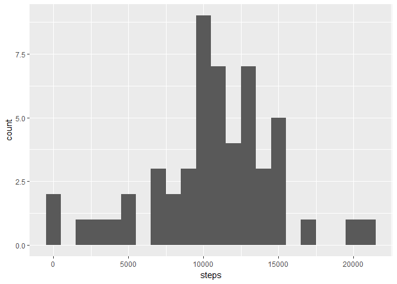
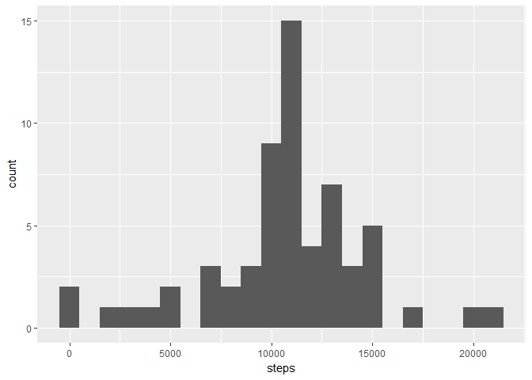
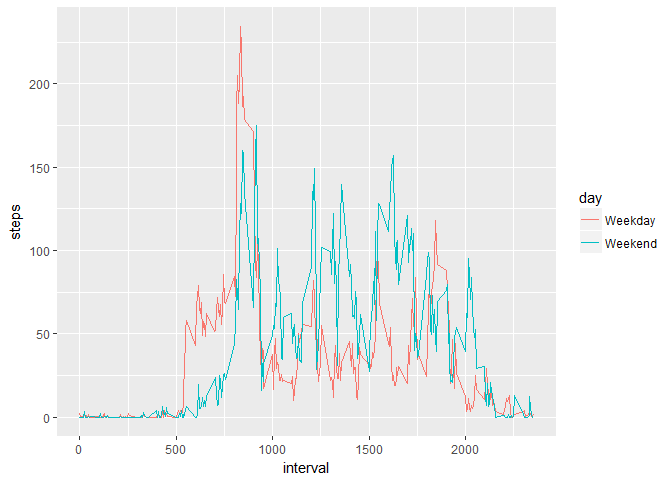

# PA1_template.Rmd
Klemen Rizman  
December 30, 2016  


## Read and clean data
Read data and transform variable date from char to date.

```r
library(ggplot2)
library(plyr)
my.data <- read.csv("activity.csv", stringsAsFactors = FALSE)
my.data[,"date"]<- as.Date(my.data[,"date"])
```

## Histogram of the total number of steps taken each day
1. Create new data frame with calculated mean by day
2. Plot histogram
3. Calculate mean and median


```r
steps.day <- aggregate(steps ~ date, my.data, sum)
ggplot(steps.day, aes(x = steps)) + geom_histogram(binwidth = 1000)
```

<!-- -->

## Mean and median number of steps taken each day

```r
mean(steps.day$steps)
```

```
## [1] 10766.19
```

```r
median(steps.day$steps)
```

```
## [1] 10765
```

## What is the average daily activity pattern?
Create new data frame with caculated mean for each interval
Plot data frame

```r
steps.interval <- aggregate(steps ~ interval, my.data, mean)
ggplot(steps.interval, aes(x=interval, y=steps)) + geom_line()
```

<!-- -->

## Imputing missing values
1. Replaced missing value with average value of the interval
2. Plot new data

```r
sum(is.na(my.data$steps))
```

```
## [1] 2304
```

```r
sum(!is.na(my.data$steps))
```

```
## [1] 15264
```

```r
my.data.clean <- my.data
nas <-is.na(my.data.clean$steps)
my.data.mean <- join(my.data.clean, steps.interval, by="interval")
my.data.clean[nas,"steps"] <-my.data.mean[nas,4]
my.data.clean <- aggregate(steps ~ date, my.data.clean, sum)
ggplot(my.data.clean, aes(x = steps)) + geom_histogram(binwidth = 1000)
```

<!-- -->

## Are there differences in activity patterns between weekdays and weekends?
1. Create data frame with weekend and weekday labels
2. Create data frame that calculate mean bye interval and day(weekend|weekday)
3. Plot data frame

```r
week <- mutate(my.data, day=ifelse(weekdays(date)=="Sunday" | weekdays(date)=="Saturday","Weekend","Weekday"))
steps.interval2 <- aggregate(steps ~ interval+day, week, mean)
ggplot(steps.interval2, aes(x=interval, y=steps, colour=day)) + geom_line()
```

<!-- -->
